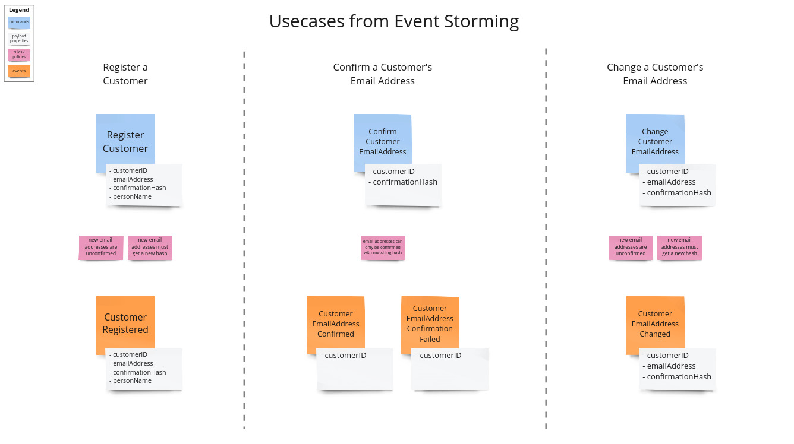
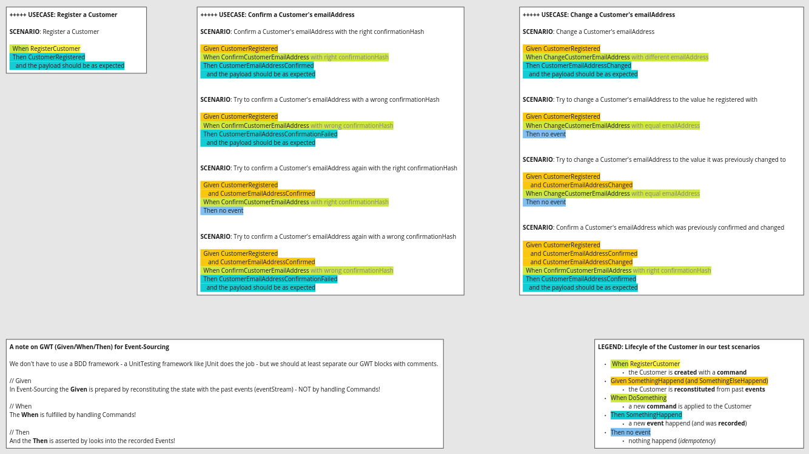

# Aggregate Implementation Patterns
There are a lot of different possibilities when implementing an aggregate. Many of them are not generally better than
others, hence it's crucial to take the use case into account when deciding for one model. We want to have a look at a few
different patterns together and discuss their pros and cons. In the end, you should have more options to choose from for
your next project. 

## Implementation Characteristics
While this is certainly a very simplified approach, we'll focus on the following two primary dimensions:
* event-sourced vs. traditional (i.e. full state gets persisted)
* functional vs. object-oriented

We have prepared 7 variants of the Customer model for you, and most of them contain **tasks** that you will have 
to solve. Here is how those variants map to our two dimensions:

|         | ES                                    | TRAD         |
| ------- | :------------------------------------ | -----------: |
| **OOP** | *Customer3*, *Customer4*              | *Customer1*  |
| **FP**  | *Customer5*, *Customer6*, *Customer7* | *Customer2*  |

## Our Aggregate Example
In this workshop, we want to focus on a Customer aggregate supporting three simple use cases. The details, which you can
find below, could have been collected in an *Event Storming* workshop beforehand:

### Customer Registration
Command: **RegisterCustomer** with properties
* customerID (ID)
* emailAddress (EmailAddress)
* confirmationHash (Hash)
* name (PersonName)

Event: **CustomerRegistered** with properties
* customerID (ID)
* emailAddress (EmailAddress)
* confirmationHash (Hash)
* name (PersonName)

**Rules & Policies**:
* new email addresses are unconfirmed
* new email addresses must get a new hash

### Email Confirmation
Command: **ConfirmCustomerEmailAddress** with properties
* customerID (ID)
* confirmationHash (Hash)

Event: **CustomerEmailAddressConfirmed** or **CustomerEmailAddressConfirmationFailed**, both with property
* customerID (ID)

**Rules & Policies**:
* email addresses can only be confirmed with matching hash

### Email Change 
Command: **ChangeCustomerEmailAddress** with properties
* customerID (ID)
* emailAddress (EmailAddress)
* confirmationHash (Hash)

Event: **CustomerEmailAddressChanged** with properties
* customerID (ID)
* emailAddress (EmailAddress)
* confirmationHash (Hash)

**Rules & Policies**:
* new email addresses are unconfirmed
* new email addresses must get a new hash

##### Hint
Our Customer gets registered with a name (PersonName), but we have removed the *Change Name* use-case for brevity,
so that you are able to implement all use-cases in all variants. Still, there is a *ChangeCustomerName*
Command and a *CustomerNameChanged* Event in the codebase. If we are super fast, we can use them to add this use-case.

## General Instructions to solve the tasks
We have prepared 7 variants of the Customer model for you, and most of them contain **tasks** that you will have to solve.

For each model variant, you can find a class *CustomerX* containing production code as well as a corresponding test
class *CustomerXTest*, which contain the following test scenarios which are written in the Given/When/Then
(GWT, Gherkin language) format:

For each *CustomerX*:  
The production code is **missing relevant pieces of code** which you will have to fill to make
the tests green. There are **TODO** comments which mark where code is missing. You don't have to modify test cases,
and you don't have to modify the existing code to complete the tasks.
Please always make the first failing test green!  

## Setup
The repository contains a *Gradle* build file to set up the dependencies (Junit 5.7).

## Primer

The two traditional (full state gets persisted) variants are rather trivial, each of you has probably implemented 
such models before. Therefore, we will just have a look at them together and discuss them. One interesting aspect
will be how to test them.

### OOP & Traditional

#### Customer1
* state and behavior is the same object
* directly modifies the state

### Functional & Traditional

#### Customer2
* state and behavior are different objects
* directly modifies the state

## Exercises - Implement the following variants

### OOP & Event-Sourced

#### Customer3
* directly returns the events that have happened

#### Customer4 (*optional*)
* records the events that have happened
* the client (e.g. an Application Service) has to request those events

### Functional & Event-Sourced

#### Customer5
* internal state per function (variables)
* those variables get reconstituted inside of the behavior functions from the events that are given as input

#### Customer6
* uses a state object (*CustomerState*)
* this is reconstituted inside of the behavior functions from the events that are given as input

#### Customer7 (*optional*)
* uses a state object (*CustomerState*)
* this is reconstituted outside and given as input to the behavior functions

### Bonus task (in case we are very fast)

#### Implement the *Change Name* use-case with your favourite variant(s)
* figure our the requirements with your group
* have a look at the *ChangeCustomerName* Command and *CustomerNameChanged* Event
* implement the required test cases first
* implement just enough production code to make the test pass